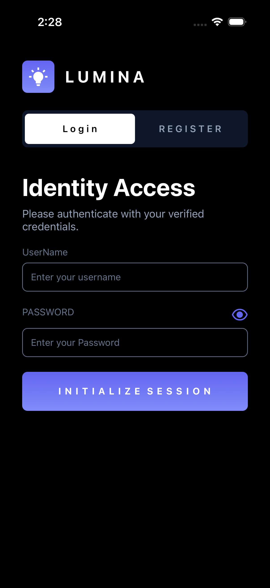
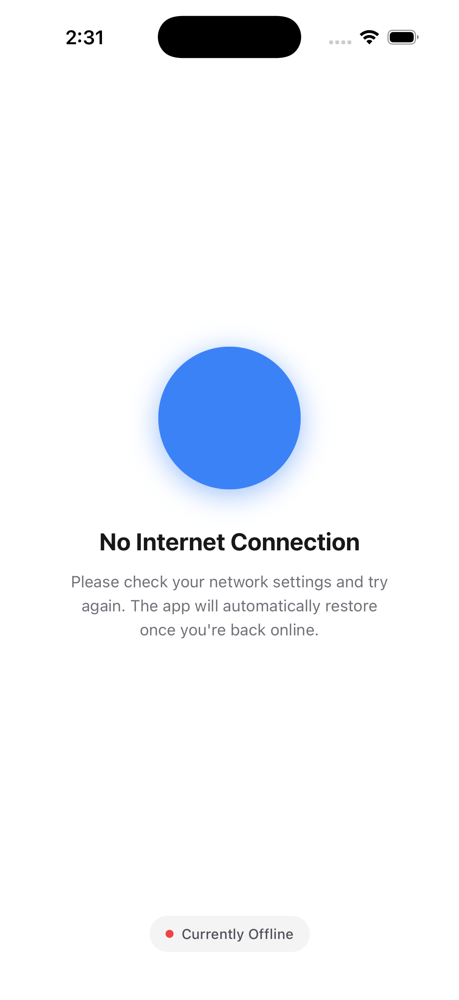

# MiniLMS

A React Native + Expo app built as part of a developer assignment. The goal was to build a Mini LMS — authentication, course browsing, WebView integration, native features, offline handling, and decent performance. Data comes from [FreeAPI](https://freeapi.app).

## What's Built

**Auth**
Login and registration against the FreeAPI `/api/v1/users` endpoints. Tokens are stored in Expo SecureStore so the session survives app restarts. Logout clears everything cleanly.

**Course Catalog**
Pulls instructors from `/api/v1/public/randomusers` and courses from `/api/v1/public/randomproducts`. Rendered in a Legend-List with pull-to-refresh, search filtering, and bookmark toggles. Bookmarks persist locally via MMKV.

**Course Details**
Full detail view per course with an Enroll button and bookmark toggle. Bookmark state is stored locally and synced with global context.

**WebView**
Course content loads in a WebView using a local HTML template. Native-to-WebView communication is handled via injected headers.

**Notifications**
- Triggers a local notification when you bookmark 5 or more courses
- Sends a reminder notification if the app hasn't been opened in 24 hours

**Offline Handling**
Network state is monitored continuously. An offline banner appears when there's no connection. API calls handle timeouts and failures with user-friendly error messages and a retry mechanism.

**Profile**
Displays user info fetched from the auth response. Supports profile picture updates and shows basic stats.

## Tech Stack

| Area | Choice |
|---|---|
| Framework | React Native, Expo SDK 54 |
| Language | TypeScript (strict mode) |
| Navigation | Expo Router |
| Styling | NativeWind |
| Secure storage | Expo SecureStore |
| App storage | MMKV |
| Forms | React Hook Form + Zod |
| Networking | Axios |
| Lists | Legend-List |
| Images | Expo Image |
| Animations | React Native Reanimated |

## Project Structure

```
/app
  /(auth)       # Login, Register screens
  /(root)       # Tab layout, Course list, Details, WebView, Profile
/components     # Shared UI components
/src
  /api          # Axios instance, endpoint functions
  /context      # Auth and Bookmark context providers
  /storage      # MMKV and SecureStore abstractions
  /validation   # Zod schemas
/assets         # Fonts, icons, images
```

## Getting Started

Requirements: Node.js 18+, Expo Go or a simulator.

```bash
git clone <https://github.com/Shades7209/Architect_minilms.git>
cd minilms
npm install
npm start
```

Press `a` for Android, `i` for iOS. No `.env` setup needed — FreeAPI is public and already configured.

## Screenshots






## Architectural Decisions

**Why MMKV over AsyncStorage?** MMKV is synchronous and significantly faster for frequent reads like bookmark state. AsyncStorage made sense only where async was acceptable (less critical preferences).

**Why Legend-List over FlatList?** FlatList has well-known performance issues with large lists on lower-end Android devices. Legend-List handles windowing more efficiently and the API is familiar enough that the switch wasn't painful.

**Context over Redux/Zustand?** The app's state surface is small — auth state and bookmarks. Adding a full state library felt like overkill here. If the course list grows to need server-synced state or pagination caching, I'd move to Zustand.

**Expo Router for navigation** — file-based routing maps well to the auth vs. root split and keeps the navigation logic out of component files.

## Known Issues / Limitations

- Token refresh is basic — expired tokens redirect to login rather than silently refreshing. A proper refresh queue is the next thing to add.
- Course list state is screen-local. If you navigate away and back, it re-fetches. Moving this to a shared store is on the roadmap.
- No EAS Build pipeline yet — APK was built manually via `eas build --profile development`.
- Landscape support exists but a few screens aren't fully optimised for it yet.

## Demo Video

3–5 minute walkthrough covering: register → browse courses → search → bookmark → course detail → WebView lesson → offline state.

[\[Link to video\]](https://drive.google.com/file/d/1r4Zx8vhtEnSFa4aTDbj1xX9jgt5YOxQp/view?usp=sharing)

## APK

Available in the [Releases](../../releases) section of this repo.
